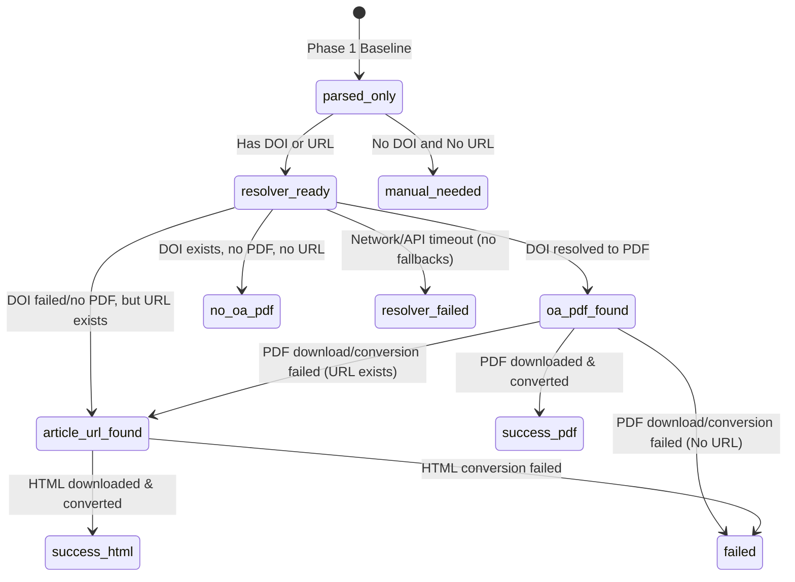

# Phase 2 Resolver Design & Progress Plan
**Status**: Phases 2A, 2B, 2C, and 2D Completed

This document establishes the technical design, API boundaries, state-machine transitions, output schemas, and progress history for the Phase 2 Resolver Pipeline and its subsequent hardening features.

---

## 1. Resolver Contracts

### 1.1 DOI Resolver Contract
The DOI resolver is responsible for identifying Open Access PDF links from paper DOIs.

- **Primary Source (Unpaywall)**:
  - **Endpoint**: `https://api.unpaywall.org/v2/{doi}`
  - **Required Parameters**: `email` (string query parameter; must be a valid email syntax).
  - **Rate Limiting**: Bounded to maximum 1 request per second (using a delay of `1.0`s).
  - **JSON Response Mapping**:
    - Check `is_oa` (bool).
    - If true, parse `best_oa_location` -> `url_for_pdf` (string URL).
- **Secondary Source (OpenAlex Fallback)**:
  - **Endpoint**: `https://api.openalex.org/works/https://doi.org/{doi}`
  - **Required Headers**: `User-Agent` containing email (e.g. `mailto:email@example.com`).
  - **JSON Response Mapping**:
    - Check `open_access.is_oa` (bool).
    - If true, parse `best_oa_location.pdf_url` (string URL).

### 1.2 URL Resolver Contract
The URL resolver extracts main text content from landing pages when a direct OA PDF cannot be found.

- **Trigger**: No OA PDF URL returned by DOI query, but an alternative landing page URL is present.
- **Conversion Engine**: Invoke subprocess `scripts/html_to_md.py <url> -o md/{record_id}.md --quiet`.
- **Content Filtering**: Uses `trafilatura` to extract main article text while stripping noise (navigation, sidebars, headers, ads).
- **User-Agent**: Custom header imitating a standard web browser to prevent simple bot blocks on public landing pages.

---

## 2. API & Safety Boundaries

### 2.1 Legal & Open-Access Policy
- **Open Access Only**: We only fetch PDFs explicitly marked as Open Access with open licenses.
- **No Paywall Bypassing**: The tool must never scrape behind paywalls, login screens, or manipulate cookies to access restricted articles.
- **No CAPTCHA / Proxy Bypassing**: If a page returns `401 Unauthorized`, `403 Forbidden`, `429 Too Many Requests`, or triggers bot protection, the resolver must abort and label the paper as `failed` or `manual_needed`.
- **No Sci-Hub**: Banned. The tool must not query unauthorized repositories.

---

## 3. Resolver State Machine

### 3.1 Status Transitions
The resolving process moves records from Phase 1 parsed baselines through resolver pipelines:

---

## 4. Manifest & JSONL Metadata Schema

### 4.1 manifest.csv Schema
Columns required for the ingestion pipeline:
- `record_id`: Unique slug.
- `title`: Paper title.
- `authors`: Semicolon-separated list of authors.
- `year`: Publication year.
- `doi`: Document Object Identifier.
- `url`: Alternative URL / landing page.
- `status`: Record status code (e.g. `success_pdf`, `success_html`, `download_forbidden`, etc.).
- `resolver_status`: `not_started`, `unpaywall_lookup`, `openalex_lookup`, `html_fallback`, `completed`, `failed`.
- `resolution_note`: Text description of results or failure details.
- `pdf_download_path`: Path to saved PDF (`pdfs/record_id.pdf` or empty).
- `markdown_path`: Path to saved Markdown file (`md/record_id.md` or empty).
- `resolver_mode`: `"real"`, `"mock"`, or `"offline_parser"`.
- `network_used`: `True` or `False`.
- `resolver_source`: `"unpaywall"`, `"openalex"`, or `"none"`.
- `resolver_http_status`: Resolver API response status.
- `oa_pdf_url`: The direct PDF URL found.
- `article_url`: Alternative landing page URL.
- `real_download_performed`: `True` or `False`.
- `huashu_conversion_performed`: `True` or `False`.
- `html_to_md_performed`: `True` or `False`.
- `mock_artifact`: `True` or `False`.
- `download_http_status`: PDF download status code.
- `download_error_detail`: PDF download error message.
- `conversion_status`: PDF to MD conversion status.
- `conversion_error_detail`: PDF to MD conversion error message.
- `extraction_quality_status`: Quality gate validation status.
- `extraction_quality_note`: Quality gate diagnostic message.

---

## 5. Progress History

### 5.1 Phase 2A: Resolver Planning
- Designed DOI contracts, state-machine transitions, rate limiting, and open-access compliance.
- **Status**: Completed.

### 5.2 Phase 2B: Offline Mock Resolver Harness
- Implemented offline `--mock-resolver` mode simulating all pipeline scenarios without calling endpoints.
- **Status**: Completed.

### 5.3 Phase 2C: Real DOI Resolver Integration
- Implemented live `--resolve-doi` lookup integrating Unpaywall and OpenAlex API. Added polite delay and error mapping.
- **Status**: Completed.

### 5.4 Phase 2D: Landing Page HTML Fallback
- Implemented HTML landing page extraction using `scripts/html_to_md.py` via `trafilatura` if direct PDFs fail or are unavailable.
- **Status**: Completed.
