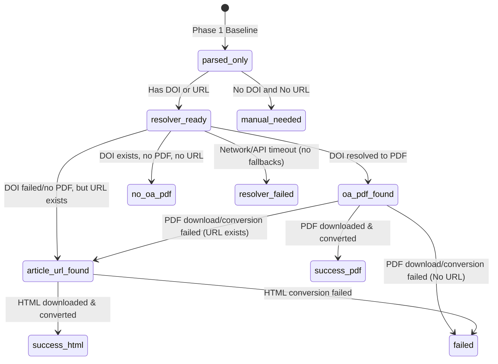

# Phase 2 Resolver Design & Progress Plan
**Status**: Phase 2A (Design), Phase 2B (Offline Mock), Phase 2C (Real DOI Resolver) Completed

This document establishes the technical design, API boundaries, state-machine transitions, output schemas, and progress history for the Phase 2 Resolver Pipeline.

---

## 1. Resolver Contracts

### 1.1 DOI Resolver Contract
The DOI resolver is responsible for identifying Open Access PDF links from paper DOIs.

- **Primary Source (Unpaywall)**:
  - **Endpoint**: `https://api.unpaywall.org/v2/{doi}`
  - **Required Parameters**: `email` (string query parameter; must be a valid email syntax).
  - **Rate Limiting**: Bounded to maximum 1 request per second (using a thread delay of `1.0`s).
  - **JSON Response Mapping**:
    - Check `is_oa` (bool).
    - If true, parse `best_oa_location` -> `url_for_pdf` (string URL).
- **Secondary Source (OpenAlex Fallback)**:
  - **Endpoint**: `https://api.openalex.org/works/https://doi.org/{doi}`
  - **Required Headers**: `User-Agent` containing email (e.g. `mailto:email@example.com`).
  - **JSON Response Mapping**:
    - Check `open_access.is_oa` (bool).
    - If true, parse `best_oa_location.pdf_url` (string URL).
- **Metadata Fallback (Crossref)**:
  - Used only for enriching missing record fields (such as titles, publication years) if RIS/CSV is incomplete.

### 1.2 URL Resolver Contract
The URL resolver extracts main text content from landing pages when a direct OA PDF cannot be found.

- **Trigger**: No OA PDF URL returned by DOI query, but an alternative landing page URL is present.
- **Conversion Engine**: Invoke subprocess `scripts/html_to_md.py <url> -o md/{record_id}.md --quiet`.
- **Content Filtering**: Uses `trafilatura` to extract main article text while stripping noise (navigation, sidebars, headers, ads).
- **User-Agent**: Custom header imitating a standard web browser (e.g., Chrome on macOS) to prevent simple bot blocks on public landing pages.

---

## 2. API & Safety Boundaries

### 2.1 Legal & Open-Access Policy
- **Open Access Only**: We only fetch PDFs explicitly marked as Open Access with open licenses.
- **No Paywall Bypassing**: The tool must never scrape behind paywalls, login screens, or manipulate cookies to access restricted articles.
- **No CAPTCHA / Proxy Bypassing**: If a page returns `401 Unauthorized`, `403 Forbidden`, `429 Too Many Requests`, or triggers bot protection, the resolver must abort and label the paper as `failed` or `manual_needed`.
- **No Sci-Hub**: Banned. The tool must not query unauthorized repositories.

---

## 3. Resolver State Machine

### 3.1 Status Transitions
The resolving process moves records from Phase 1 parsed baselines through resolver pipelines:



---

## 4. Manifest & JSONL Metadata Schema

### 4.1 manifest.csv Schema
Columns required for the Phase 2 index:
- `record_id`: Unique slug.
- `title`: Paper title.
- `authors`: Semicolon-separated list of authors.
- `year`: Publication year.
- `doi`: Document Object Identifier.
- `url`: Alternative URL / landing page.
- `status`: `success_pdf`, `success_html`, `no_oa_pdf`, `failed`, `manual_needed`.
- `resolver_status`: `not_started`, `unpaywall_lookup`, `openalex_lookup`, `html_fallback`, `completed`, `failed`.
- `resolution_note`: Text description of results or failure details.
- `pdf_download_path`: Path to saved PDF (`pdfs/record_id.pdf` or empty).
- `markdown_path`: Path to saved Markdown file (`md/record_id.md` or empty).

### 4.2 papers.jsonl Schema
Each JSON object contains full normalized metadata plus a rich `resolver_results` dict:
```json
{
  "record_id": "...",
  "title": "...",
  "authors": ["..."],
  "year": "...",
  "doi": "...",
  "url": "...",
  "journal": "...",
  "source_file": "...",
  "resolver_results": {
    "status": "...",
    "resolver_status": "...",
    "resolution_note": "...",
    "unpaywall_queried": true,
    "oa_pdf_url": "...",
    "pdf_download_path": "...",
    "html_fallback_attempted": true,
    "markdown_path": "...",
    "error_detail": "..."
  }
}
```

---

## 5. Progress & Roadmap

### 5.1 Phase 2B: Offline Mock Resolver Harness (Completed)
- **Harness Mode**: `--mock-resolver` CLI flag runs resolver simulation without live internet queries.
- **Wording Semantics**: Clearly records simulated behaviors inside mock files (e.g. `%PDF-1.4\n% MOCK PLACEHOLDER`) and output metadata logs, ensuring that no logs imply real downloads took place.
- **Evidence Fields**: Logs `resolver_mode = mock`, `network_used = false`, `real_download_performed = false`, `huashu_conversion_performed = false`, `mock_artifact = true`.

### 5.2 Phase 2C: Real DOI Resolver Integration (Completed)
- **Live Integration**: `--resolve-doi` CLI flag performs queries against Unpaywall (primary) and OpenAlex (secondary fallback).
- **Polite Rate Limiting**: Inter-request delay is enforced using a `--delay` timer (defaults to `1.0` seconds).
- **PDF Download Test**: If direct OA PDF URL is found, downloads to `pdfs/record_id.pdf` and verifies the `%PDF` signature header. If download succeeds, sets status to `success_pdf` and `real_download_performed = True`.
- **Error Handling**: Fails gracefully if endpoints return non-200 responses or timeout (status is marked as `failed` or `no_oa_pdf`).
- **No Paywall Bypass**: Adheres to strict open-access legal boundaries. Bypassing paywalls or using Sci-Hub/proxies is forbidden.

### 5.3 Phase 2D: Landing Page HTML Fallback (Next)
- **Objective**: Implement Fallback HTML conversion when direct PDFs are unavailable.
- **Interface & Behavior**:
  - Activated when `status = success_html`.
  - Extract page content using `scripts/html_to_md.py` via `trafilatura` to save clean Markdown text into `md/record_id.md`.
  - Record landing page link in `article_url` and set `markdown_path = md/record_id.md`.
  - Maintain paywall/login safety boundaries; do not scrape behind login walls.
