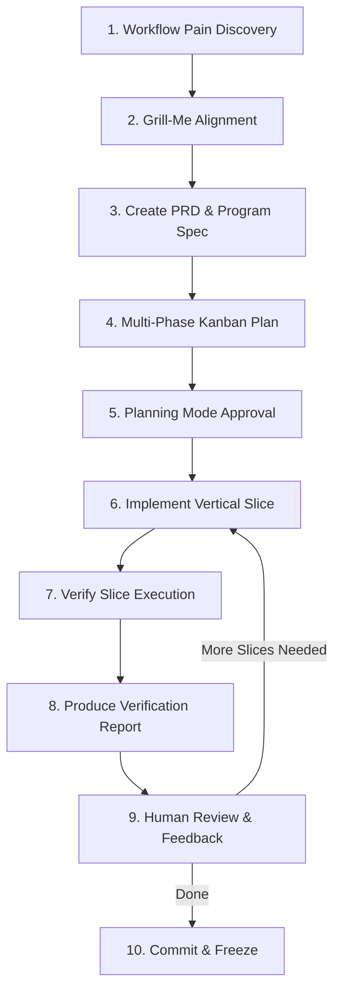

# Antigravity Tool Factory Protocol (ATFP)
Version 1.0

The **Antigravity Tool Factory Protocol** is a structured, human-in-the-loop development framework designed for building local workflow tools. It adapts the principles of Boris-style development to the Antigravity agentic workspace.

---

## Core Principles

1. **Solve Workflow Pain First**: Tools must directly address concrete friction in the user's daily operations.
2. **Design Before Code**: Establish the product requirements (PRD) and step specifications (`.program.md`) before writing a single line of application code.
3. **Small Vertical Slices**: Implement features incrementally in minimal, end-to-end executable units rather than all at once.
4. **Human in the Loop**: Always obtain explicit human review at critical boundaries (planning, implementation slicing, and checking in/committing).

---

## The 10-Step Workflow

### 1. Workflow Pain Discovery
Identify what friction the user is encountering. Rather than creating generic wrappers, specify what manual actions the tool will automate (e.g., scraping, ingestion, formatting, compiling).

### 2. Alignment & Interview (`/grill-me`)
Initiate a discussion with the user to resolve design decisions. Recommending the `/grill-me` slash command helps define bounds such as:
- What are the source data constraints?
- What fallback paths are desired?
- What libraries are allowed/disallowed?

### 3. Product Requirement Document (PRD)
Create a PRD under the `docs/` folder (e.g., `docs/<TOOL_NAME>_PRD.md`). The PRD must define:
- Core features and success metrics.
- Input file constraints (e.g., file types, parsing expectations).
- Pipeline behavior (rate-limiting, API parameters, offline mode).
- Outputs (directory structures, metadata schemas).

### 4. Program Specification (`.program.md`)
Specify the tool as an executable blueprint under a `programs/` directory (e.g., `programs/<tool-name>.program.md`). This document describes the step-by-step logic, input/output contracts, CLI arguments, and error states, ensuring the implementation details are separated from the code.

### 5. Antigravity Planning Mode
Formulate a formal `implementation_plan.md` in the App Data Directory:
- Set `request_feedback = true` in the metadata.
- Detail the code changes, new files, and verification steps.
- **STOP and wait** for the user's explicit approval before writing code.

### 6. Small Vertical Slices
Implement the tool in vertical slices (e.g., parser first, then retriever, then file writer). Avoid writing the entire codebase in one large file write. Use a step-by-step checklist in `task.md`.

### 7. Verify After Every Slice
After each slice is written, immediately run verification commands:
- Run unit tests or dry tests using python/binaries.
- Run linting checks if available.
- Capture stdout/stderr logs.

### 8. Produce Verification Report
Write a verification summary in `walkthrough.md` or a dedicated artifact:
- Report exact files created/modified.
- Report exact commands run and paste their output logs.
- Show output directories and sample outputs.

### 9. Human Review & Feedback
Review the verification report with the user. If bugs or behavior changes are requested, return to Step 5 or 6 depending on scope.

### 10. Commit & Freeze
Commit and freeze the tool only after the user manually verifies and approves the final walkthrough. Do not auto-commit or auto-push during active development slices.

---

## Templates & Guidelines

### Program Specification Blueprint (`.program.md`)
Every tool must have a program blueprint located in `programs/` mapping:
1. **Metadata**: Tool name, version, status.
2. **Contract**: Required inputs, CLI arguments, output directory structure.
3. **Execution Steps**: Logical sequence of functions (e.g. parse -> resolve -> write).
4. **Validation Rules**: Exact assertions to run to verify correctness.
